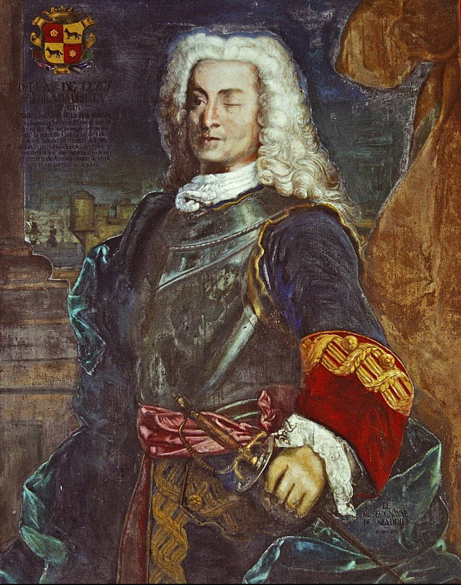

## **HUNDIR LA FLOTA AMBIENTADO EN BLAS DE LEZO**
> **Grupo 4**, conformado por: Alba María Romero, Fernando Manzano, Pedro Pérez y Pepe Reina.
>> Decidimos ambientar nuestro juego en [Blas de lezo](https://es.wikipedia.org/wiki/Blas_de_Lezo). Para ello, el juego inicia con una pequeña presentación del personaje, en la que Blas pide que introduzcas tu nombre.  
  
>>IMAGEN DE LA ENTRADA EN WIKIPEDIA   
   
##El mensaje de presentación es el siguiente:** 
>> ¡Saludos, marinero intrépido! 
Soy Blas de Lezo y Olavarrieta, nacido en Pasajes, Guipúzcoa, el 3 de febrero de 1689. 
A lo largo de mi vida, he surcado los mares y enfrentado numerosas batallas, 
quedando marcado por las heridas de guerra que adornan mi figura: 
un ojo tuerto, un brazo inmovilizado y una pierna arrancada. 
A pesar de estas adversidades, he demostrado ser un estratega formidable, 
siendo considerado uno de los mejores almirantes de la historia de la Armada Española.   
Hoy necesito tu ayuda, 
te invito a participar en una emocionante batalla naval,       
donde la astucia y la estrategia serán nuestras mejores armas. 
Antes de adentrarnos en esta aventura marítima,  
¿Con qué nombre quieres que te recuerde la historia?   
>>> Este es el momento de introducir el nombre.

## OK, MUY INTERESANTE, LO SÉ... PERO HABLEMOS DE CÓMO HEMOS LLEGADO AL RESULTADO FINAL.

Tuvimos diferentes "líneas de pensamiento", es decir, diferentes aproximaciones sobre cómo abordar el proyecto. Intentamos mostrar ambos tableros, el del jugador y el del enemigo, en los cuales la estética y lo visual eran lo primordial, utilizando para ello un código bastante largo y que resultaba bastante engorroso de "orientarlo a objetos". Otra de las opciones que probamos fue el uso de matrices tridimensionales, lo cual, aunque funcional, no era fácil de comprender, por lo que optamos por el camino del medio.

## EN CUANTO A LA JUGABILIDAD...

Tras introducir el nombre del jugador el juego saluda al jugador se crean los tableros y se muestran. El mesaje mostrado es el siguiente:  
>>"Bienvenido, "NOMBRE INTRODUCIDO", preparemonos para la batalla!
>>
>>El campo de batalla está listo para la acción.
Ahora, es momento de posicionar nuestros barcos en las aguas revueltas.   
Nuestras fuerzas y las del enemigo son parejas.  
Cada bando cuenta con:  
4 barcos de 1 posición de eslora  
3 barcos de 2 posiciones de eslora  
2 barcos de 3 posiciones de eslora  
1 barco de 4 posiciones de eslora  
>>
>>Confía en mi criterio para colocar los barcos.  
Tu responsabilidad es hundir la flota enemiga,  
así que céntrate en dirigir los disparos de nuestra artillería  
>>
>>ATENTO, "NOMBRE INTRODUCIDO": En un mar embrabecido ~~~ veras   
los disparos fallidos como O,  
los aciertos como X y  
los barcos hundidos como H."  
>>>👁️‍🗨️ En un primer momento se imprimen los barcos del enemigo, solo para mostrar que su disposición es aleatoria y que no siempre ocupan las mismas coordenadas. Obviamente, para un juego justo, esto no debería ser así, pero un simple "#" basta para que este no aparezca impreso. 

Para jugar, la máquina nos irá pidiendo que introduzcamos coordenadas, separadas por coma y, obviamente, primero filas y después columnas, marcando dónde fue el tiro y si este fue al agua o a un barco enemigo, avisando también cuando hundimos un barco.
Si el tiro fue a barco, volveremos a tirar, en caso contrario será la maquina quien dispare. 

## EXPLICACIÓN DE CADA ARCHIVO.
 
>> **Variables.py:**  
>>>En este archivo se definen las variables principales utilizadas en el juego, como el tamaño del tablero y los barcos disponibles con su longitud   respectiva. Establece la configuración básica necesaria para el juego funcionar correctamente.  

>> **Clases.py:**    
>>>Contiene la definición de la clase Tablero, que representa el tablero de juego y sus funcionalidades. Desde la inicialización del tablero hasta el   manejo de disparos y control de barcos, esta clase gestiona el estado del juego y las interacciones entre los jugadores.  

>> **Funciones.py: :**  
>>>Aquí se encuentran varias funciones utilitarias que son utilizadas en el juego. Una función importante es generar_coordenadas_aleatorias(), que se   encarga de generar coordenadas aleatorias para que la máquina realice sus disparos durante el juego.  

>> **Main.py:**  
>>>Este archivo contiene el código principal del juego. Coordina la interacción entre el jugador y la máquina, gestionando los turnos, mostrando   mensajes al jugador y controlando el flujo del juego. Es el punto de entrada y controla toda la lógica del juego, ofreciendo una experiencia de   juego fluida y entretenida.  

